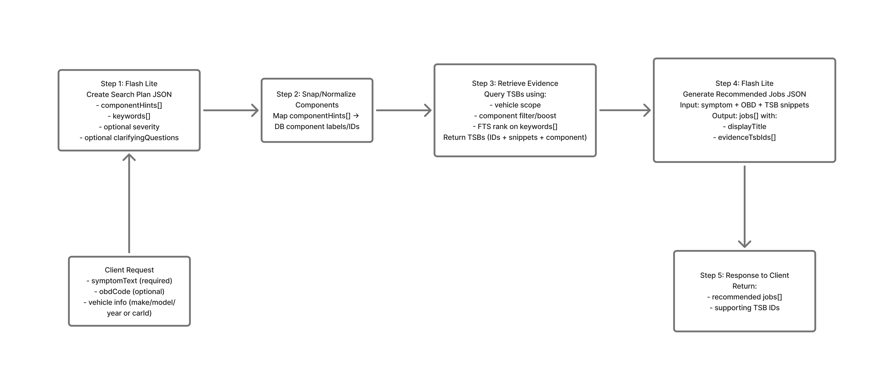

# Automic

I built this project as a dashboard for people like me who are interested in working on their own cars — whether that’s fixing things, upgrading parts, or just learning along the way. The goal is to give users a simple place to explore vehicle info, organize DIY projects, and keep track of progress in a structured way. Instead of digging through random forums or notes, everything lives in one clean interface designed to make car projects feel more manageable and less overwhelming.

### Job Assist Flow

